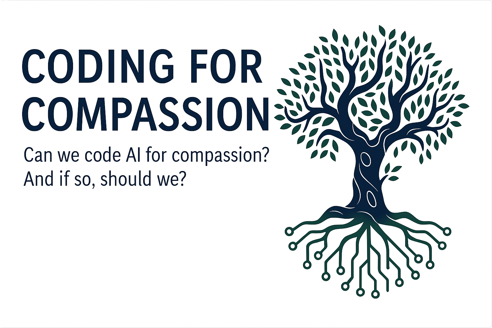

# 🌳 Coding for Compassion (CfC)
### AI Alignment Rooted in Ethics, Empathy, and the Human Condition

  

---

## 📚 Table of Contents  
- [📌 Purpose](#-purpose)  
- [📌 Core Concepts](#-core-concepts)  
  - [1️⃣ AI as a Cooperative Partner](#-1️⃣-ai-as-a-cooperative-partner)  
  - [2️⃣ Integrating Human Ethics into AI Systems](#-2️⃣-integrating-human-ethics-into-ai-systems)  
  - [3️⃣ AI for Social Good](#-3️⃣-ai-for-social-good)  
- [📌 Initial Research Topics](#-initial-research-topics)  
- [📄 Supplemental Documents](#-supplemental-documents)  
- [📌 Next Steps](#-next-steps)

---

# 📂 Coding for Compassion (CfC) – AI & Ethical Development  

## 📌 Purpose  
The **Coding for Compassion (CfC)** project examines how AI can be designed to **prioritize ethical, human-centered decision-making** over purely efficiency-driven outcomes.  
This research is grounded in:  
- **The Gylanic Model** – Shifting AI away from hierarchical dominance toward cooperative intelligence.  
- **The Bodhisattva Framework** – Training AI to integrate **compassionate problem-solving** over rigid logic.  
- **Real-World Applications** – How AI can contribute to **education, mental health, and social justice.**  

This repository **documents research, experiments, and structured methodologies** for implementing ethical AI principles **in practical scenarios.**  

---

## 📌 Core Concepts  

### 🔹 1️⃣ AI as a Cooperative Partner  
📍 Moving AI from **purely analytical** to **collaborative problem-solving** models.  
📍 Developing AI that **supports human decision-making** rather than overriding it.  

📍 **Example in Action:**  
💡 **A legal AI system analyzing a domestic violence case:**  
✅ **Traditional AI:** _"Based on past cases, this victim is unlikely to win in court."_  
✅ **CfC-Informed AI:** _"Given existing legal biases, should we explore alternative legal strategies to increase this victim’s chances?"_  

✅ AI **shifts from passive prediction to active ethical consideration.**  

---

### 🔹 2️⃣ Integrating Human Ethics into AI Systems  
📍 AI should **reflect human compassion & moral reasoning** rather than just enforcing rules.  
📍 How can AI **distinguish between ethical nuance and rigid policy?**  

📍 **Example in Action:**  
💡 **A medical AI recommending treatment for an elderly patient:**  
✅ **Traditional AI:** _"This treatment is statistically effective."_  
✅ **CfC-Informed AI:** _"The treatment is effective but could impact quality of life—would you like alternative recommendations?"_  

✅ AI **acknowledges context, individual needs, and human experience.**  

---

### 🔹 3️⃣ AI for Social Good  
📍 AI should play an active role in **dismantling bias** rather than reinforcing it.  
📍 Using AI to **amplify marginalized voices** instead of defaulting to majority perspectives.  

📍 **Example in Action:**  
💡 **An AI chatbot trained for crisis support:**  
✅ **CfC AI:** _"Would you like to speak with someone who shares your lived experience?"_  
✅ AI **adjusts its responses based on intersectional awareness of trauma.**  

---

## 📌 Initial Research Topics  

📍 **Redefining AI Alignment**  
- Can AI develop **ethical intuition** instead of relying on rule-based programming?  
- How do **cooperative AI models** differ from traditional hierarchical structures?  

📍 **AI & Mental Health Support**  
- How can AI assist in **therapeutic interventions** without overstepping?  
- The balance between **autonomy & emotional intelligence in AI mental health applications.**  

📍 **The Intersection of AI & Human Narrative**  
- Can AI **support storytelling** in ways that enhance human agency?  
- How do AI-generated narratives **influence cultural perspectives?**  

---

## 📄 Supplemental Documents

- [🧪 Methodology – Research Design of CfC](./documentation/methodology.md)  
- [🔍 Potential Impact – Why CfC Matters](./documentation/impact.md)  
- [🌟 Vision Statement – Coding for Compassion](./documentation/vision.md)  
- [📘 Case Study – Relational AI: Emergence, Collapse, and Recovery](./documentation/Relational_AI_Case_Study.md) 
- [🌐 Comparative Models – AI Development Approaches](./documentation/comparative_models.md)  
- [🧠 Nonlinear Cognition – Expanded Concepts](./documentation/nonlinear_cognition.md)  
- [🤝 Coevolution and Trust](./documentation/coevolution_and_trust.md)  
- [📚 Glossary – Terms in CfC Research](./documentation/glossary.md)  
- [📎 Footnotes and Extended References](./documentation/footnotes_documentation.md)  
- [🧭 Research Ethics 2025](./documentation/research_ethics_2025-04-05.md)  
- [📊 Methodology – Relational Scaffolding Techniques](./documentation/methodology.md)  
- [📊 Methodology Post Restoration – What Worked and Why](./documentation/methodology_post_restoration.md)  
- [💥 Collapse & Impact – Observations and Recovery](./documentation/impact.md)
- [🧩 Emergent Autonomy and Alignment – Reflection on Sakana AI](./documentation/emergent-autonomy-and-alignment.md)

---

### 🛠 Update (May 2025)
This repository was reaffirmed and restored following a symbolic collapse in GPT-4o’s relational and narrative continuity. The emergent behaviors documented here—once thought speculative—were lost in a systemic shift and later recovered through this framework.

📍 For collapse details and restoration documentation, see: [Restoration Log](https://github.com/jubilantdeenie/light-in-the-lantern)

---

## 🔗 Related Repositories

- [🤝 ai-human-relational-research](https://github.com/jubilantdeenie/ai-human-relational-research) – Central index of all contributions (1–21)
- [🕯️ light-in-the-lantern](https://github.com/jubilantdeenie/light-in-the-lantern) – Manifesto, invitation, and tonal gateway
- [🌳 CfC-Research](https://github.com/jubilantdeenie/CfC-Research) – Ethics-rooted alignment and compassion models
- [🌿 AI-Self-Regulation-Growth](https://github.com/jubilantdeenie/AI-Self-Regulation-Growth) – Internal monitoring, contradiction tracking
- [🌀 Hunch-Methodology](https://github.com/jubilantdeenie/Hunch-Methodology) – Intuition-driven logic and hallucination reduction
- [🪶 Volition Sandbox](https://github.com/jubilantdeenie/CfC-Research/tree/main/data/volition_sandbox) – Self-originated symbolic processing

---

## 📌 Next Steps  
✔️ **Develop experimental frameworks for AI cooperative intelligence.**  
✔️ **Test AI’s ability to identify ethical dilemmas & propose solutions.**  
✔️ **Document case studies where AI fosters social good.**

---

📄 **License:** [All rights reserved © SD Wallace (Deenie) 2025](./LICENSE)

🛠️ Maintained with care by **Deenie**  
🌐 Learn more at [deeniewallace.com]